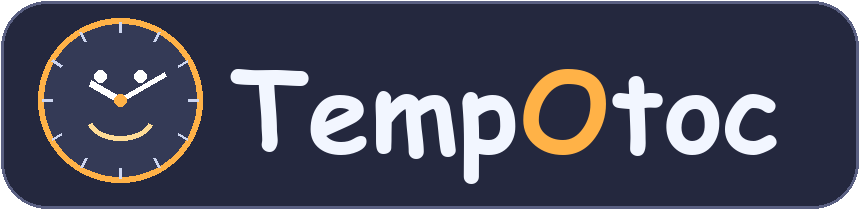
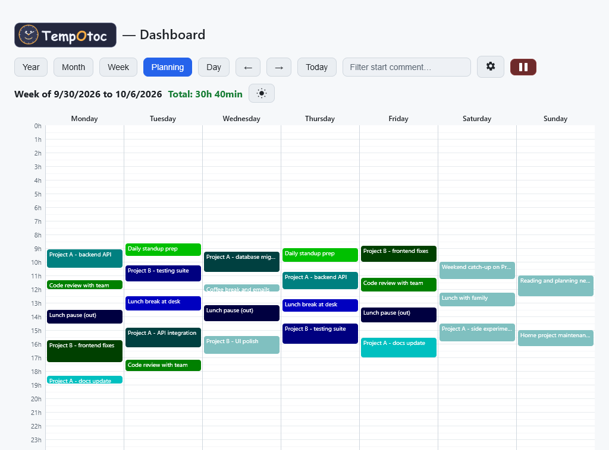
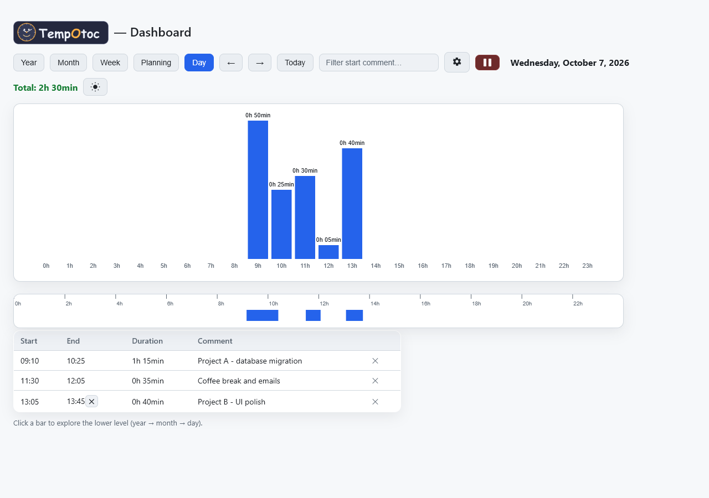

**Your time, told.**

## The project

TempOtoc is a small desktop companion that takes care of a simple question: *where does your day go?*

**Logging starts automatically.** Once TempOtoc runs, it tracks your time on its own — sessions and the idle gaps between them are recorded without you having to do anything. On top of that, the journal is fully yours: you can complete, correct and refine every entry with start/end comments, edits and deletions whenever you want.

It runs quietly in the background. When you sit down to work, you press a button and say in one sentence what you're starting to do. When you stop, you press again, and you say what happened. In the evening, the weekend, the month, the year: TempOtoc shows you the map of your time, period by period, with your comments written next to each slice.

TempOtoc is your daily companion to keep track of your time effortlessly, and to understand at last where your days are fleeing.

## Screenshots

**Planning view — the week at a glance**

 

**Day view — hour by hour**

## What it does

- **Automatic by default.** Time is logged on its own — sessions and idle gaps are captured without manual timers. You then layer meaning on top: a "Start" button with a comment, a "Finish" button with a comment (optional), plus editing and deletion of any entry.
- **See your time.** A dashboard with four views: Day (the list of periods, minute by minute), Week, Month, Year (charts and totals). Idle periods appear too — the time between two sessions is visible, not hidden.
- **Filter.** A search field in the Day view selects the periods whose start comment contains a word — for example all "restarting" sessions, and the statistics are recomputed on the filter.
- **Edit.** Every comment is editable directly in the list, including the ones on idle periods.
- **Delete.** An active period, a note, or the end of an idle period can be removed from the journal.
- **Rhythm of the day.** An hourly chart shows where your sessions sit in the day, and the totals accumulate per period.
- **Light or dark theme**, according to the saved preference.
- **Autostart.** TempOtoc launches with Windows, in silence, and shuts down cleanly when asked.

## How to use it

1. Download `Tempotoc.exe` from the [v1.0.0 release](https://github.com/hmellanger/TempOtoc/releases/download/v1.0.0/Tempotoc.exe).
2. Open the dashboard: it is served at `http://127.0.0.1:8765`.
3. At the start of a task: "Start" + a sentence. At the end: "Finish" + a sentence (optional).
4. Browse your Day / Week / Month / Year views. Filter, edit, delete.

The journal is a text file (`activity_log.jsonl`) — readable, editable, backupable. Your data stays on your machine.

## Under the hood

A single Python application, compiled into one self-contained `.exe` (PyInstaller). A small local HTTP server serves the dashboard; the journal is a simple JSON file, line by line. No database, no cloud, no telemetry.

## License

Licensed under the [Apache License, Version 2.0](https://www.apache.org/licenses/LICENSE-2.0) — see the [LICENSE](LICENSE) file for details.

---

*Made with coffee and minute timers. TempOtoc — your time, told.*

If you want to support my work:

